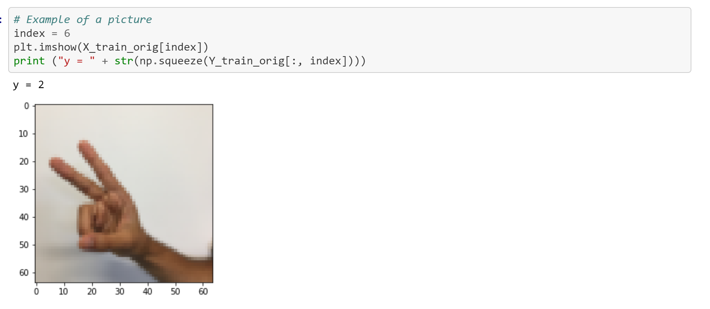

# Convolutional Neural Networks Applications

Two applicaitons of Convolutional Deep Neural Networks that I build during a CNN Specialization - Originally developed 22/05/2019

You can find everything on the two JupyterNotebooks"

## In this project it was developed 
This applicaitions were my favorite part of the course teaching me how to use frameworks to create real world projects using Deep Learning

